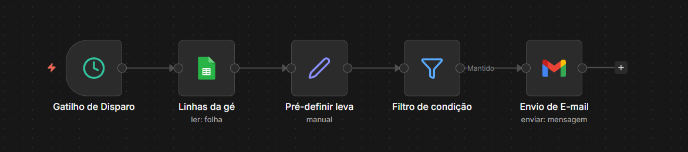

# 🚀 Automação de Contratos - GETIC
Este workflow automatiza o processo de aviso via e-mails para contratos que estão prestes a expirar no período de 1 mês.

## 📊 Visualização do Fluxo

## 🛠️ Como usar
1. Copie o conteúdo do arquivo `workflow.json`.
2. No seu n8n, clique em **Import from File** ou use `Ctrl + V`.
3. Configure as credenciais nos nós de [Exemplo: Gmail, Slack].

## 📦 Nós Utilizados
* **Schedule Node**: Inicia o fluxo toda manhã.
* **HTTP Request**: Consome a API X.
* **PostgreSQL**: Salva os logs.
